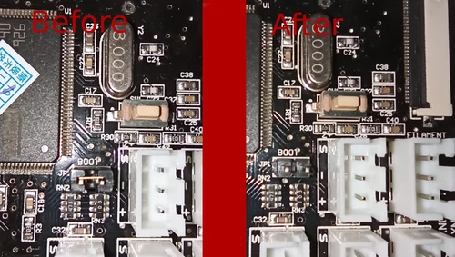
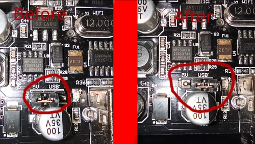
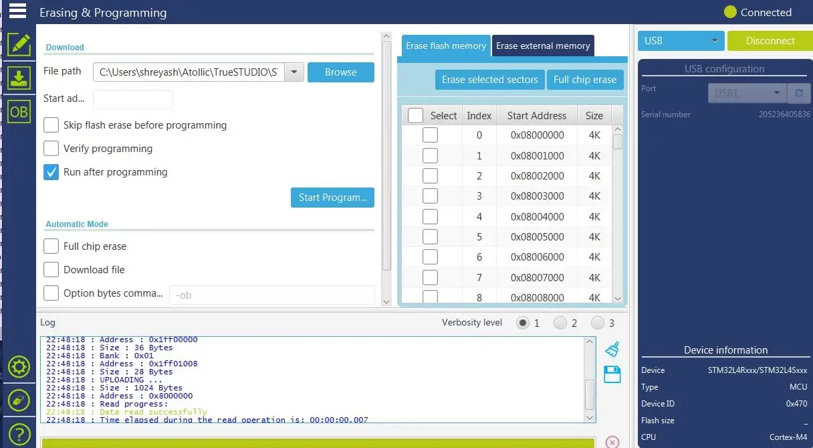
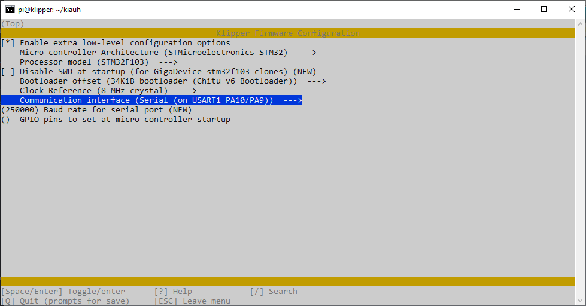
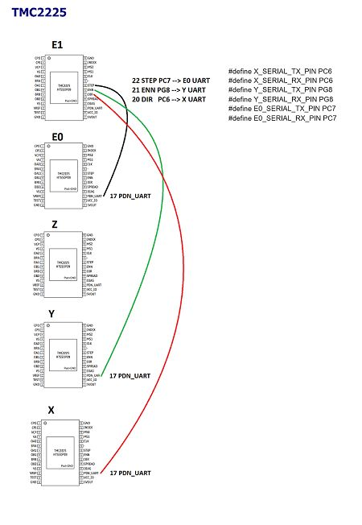
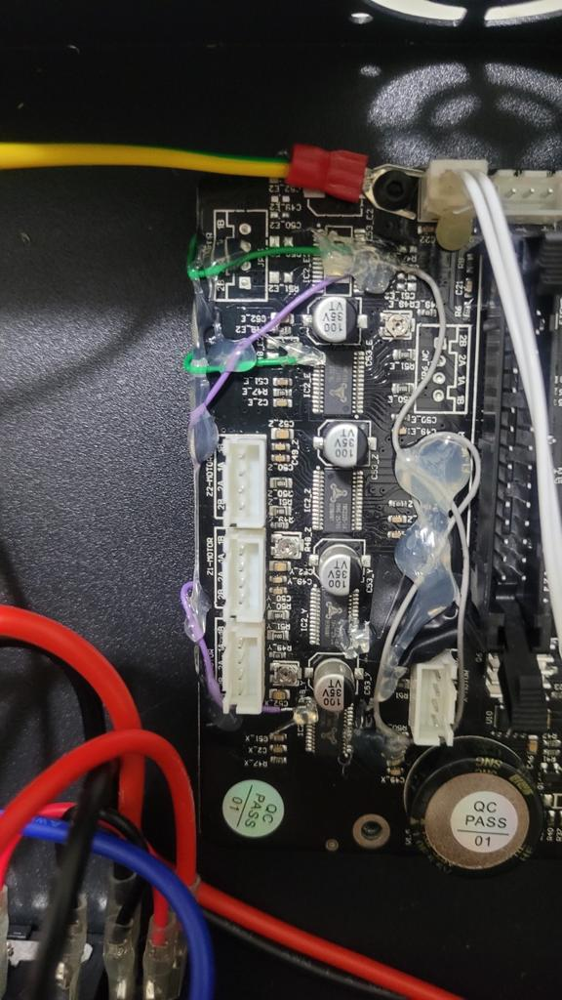

# Tronxy X5SA-PRO 330

## **🛠️ Machine setup:** 
  - Stock Chitu Board V6 (CXY-V6-191017)
  - V6 Clone Hotend
  - BMG Clone Extruder 
  - DirectDrive printed mount with a TwoTrees Pancake stepper motor
  - All steppers running on UART
  - Fimware: Klipper

# Table of Contents
- [How to unlock the Chitu V6 board's bootloader](#-How-to-unlock-the-Chitu-V6-board's-bootloader)
- [How to compile Klipper to the Chitu V6 Board (CXY-V6-191017)](#How-to-compile-Klipper-to-the-Chitu-V6-Board-(CXY-V6-191017))
- [How to enable UART on the V6 board](#How-to-enable-UART-on-the-V6-board)
- [How to update the firmware on the board](#How-to-update-the-firmware-on-the-board)


# How to compile Klipper to the Chitu V6 Board (CXY-V6-191017)

To flash Klipper to the Raspberry Pi, I recommend using the KIAUH tool linked below.
## Referência

 - [KIAUH Klipper Installation And Update Helper](https://github.com/th33xitus/kiauh)
 - [Klipper Github](https://github.com/Klipper3d/klipper)
 - [Klipper Docs](https://www.klipper3d.org/)


## **🛠️ Instructions:**

## **❗ Note:**
-This tutorial is only meant and tested for the V6-191017 Chitu board.  
-I take no responsability on the usage of any of this code or files.  
**📢 Usage of this script happens at your own risk!**

# How to unlock the Chitu V6 board's bootloader  
  -To flash a firmware to the printer's MCU, first you'll need to unlock the Bootloader (this works either for Marlin or Klipper).  

  -To unlock the bootloader,you'll need to use the STM32 Cube Programmer. I am only writing detailing all the steps from the following youtube video from ["Nozzled"](https://youtu.be/N1FaKO5QziE), [J C Nelson](https://hackaday.io/project/167594-chitu-3d-printer-mainboard-hacking) and to [Victor Oliveira](https://github.com/rhapsodyv)  

  -Unplug the power cord and turn off the printer. You are going to need to unmount the power supply and motherboard enclosure from the printer's frame and follow to strip it down so you could visually see the board.  

  -There are two jumpers where you'll need to swith they're positions:   

  -The Boot jumper will be removed for now.  

<p align="left">
  
</p>
	-The "5V - USB" jumper will be moved to the far right on the USB position.
<p align="left">
  

</p>
  -Now, you can connect the board with the provided USB cable to the PC, and follow to detect the board on STM32 Programmer via UART (far right), at 115200 baud rate, hit Connect.  

<p align="left">
  
</p>
  -If everything was done correctly up until this point, you can hit READ and the current firmware on the board will be read. You can at this moment save it so you could upload it later (only for safety reasons, I don't recommend using that firmware).   

  -Now you will start to flash the bootloader. Hit up "Erasing & Programming on the left bar. Go on "Erase Flash Memory" and click on "Full chip erase". Confirm on the dialog window that will show up.   

  -Click Browse and search for the bootloader file - [chitutronxybootloader.bin](/chitutronxybootloader/chitutronxybootloader.bin)(linked here on the bootloader section).  
 
  -Now you can already disconnect the board, set the jumpers as they were at the start and follow on to compiling and uploading the firmware.   

  -From now on, you can update your firmware only by placing the "update.cbd" file on the SD Card.   

  -If you wish to use Marlin, you can have the exact Marlin port for this board and stock setup (not running UART) on the Marlin firmware section of this repo.   
  -If you wish to use Klipper, follow as this guide goes.   


# How to compile Klipper to the Chitu V6 Board (CXY-V6-191017)
  - Create fimware bin following bellow image  
```
cd /home/pi/klipper
make menu-config 
```

<p align="left">
  
</p>


  -While at this stage, Klipper will already be compiled, to update the Chitu V6 board you'll need a "update.cbd" file, and  at this moment, you'll only have a "firmware.bin" file.   

  -To build the update.cbd:  

>"./scripts/update_chitu.py ./out/klipper.bin ./out/update.cbd"


# How to update the firmware on the board  
  -Place the "update.cbd" file on an SD card and boot the printer. It should beep 6 times and it would be correctly flashed.   

  -If coming from Marlin, you'll notice the screen no longer turns on, and that's totally normal as it is not currently supported natively on Klipper.   


#How to enable UART on the V6 board

  -The stock Chitu V6 board contains 5 stepper driver pads but only 4 stepper drivers are soldered in (for all models with only one extruder, for those with 2 extruders, UART is not capable on the stock board). 
 
  -We are then going to be using the leftover diag pins on the not used stepper driver pads to address the UART pins of the 3 drivers (X, Y and E).   
## **❗ Notes:**
  -While this process is not complicated, it definetly is not for the faint of heart. This process needs good soldering habilities, a steady hand and lots of patience.   

[UART Jumpers]

  -Following the picture above, you'll solder 3 jumper cables from pins 20 to 22 on the E1 driver, to the respective pins 17 to the E0, X and Y drivers. Take notice that some of the drivers are rotated 180°, so take reference on the pin on the far upper left on each driver. That is the first pin reference.   

[Soldered UART pins]

  -If using Marlin, the UART setup is:   

>#define X_SERIAL_TX_PIN PC6
>#define X_SERIAL_RX_PIN PC6
>
>#define Y_SERIAL_TX_PIN PG8
>#define Y_SERIAL_RX_PIN PG8
>
>#define E0_SERIAL_TX_PIN PC7
>#define E0_SERIAL_RX_PIN PC7


  -If using Klipper, the config is alreay setup in my configuration, but it also goes as:   
´´´
[tmc2208 stepper_x]    
uart_pin: PC6   
run_current: 0.8   
hold_current: 0.4    
stealthchop_threshold: 99999    
interpolate: True    
   
[tmc2208 stepper_y]
uart_pin: PG8
run_current: 0.8
hold_current: 0.4
stealthchop_threshold: 99999
interpolate: True   
    
[tmc2208 extruder]  
uart_pin: PC7  
run_current: 0.55  
hold_current: 0.3  
stealthchop_threshold: 99999   
interpolate: True   
´´´